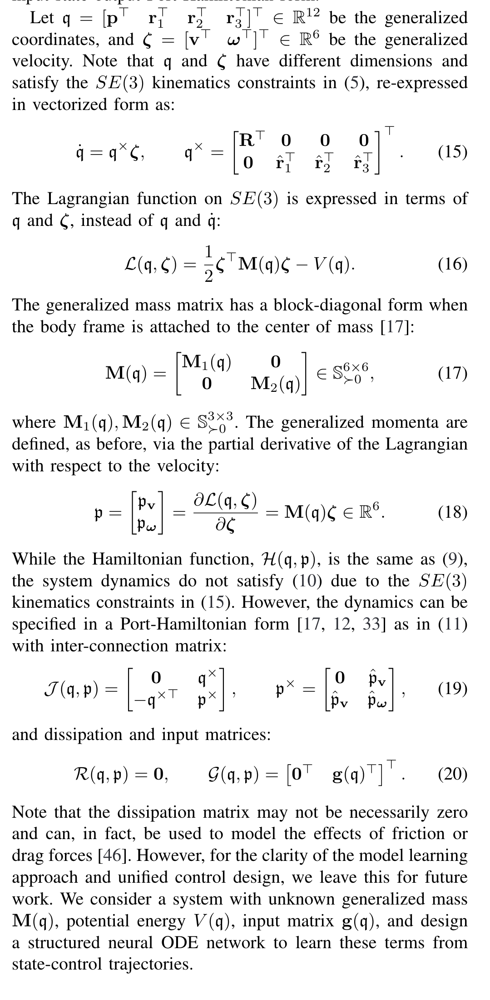
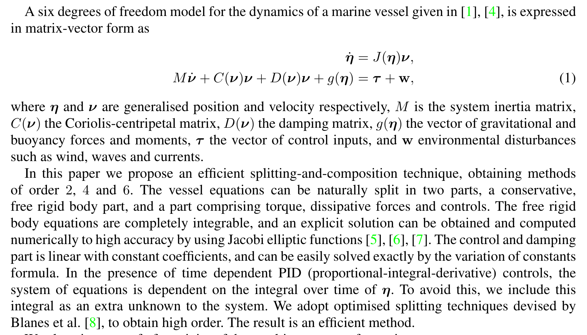

# Papers on learning port-Hamiltonian systems

### Hamiltonian-based Neural ODE Networks on the $SE(3)$ Manifold For Dynamics Learning and Control

**Abstract:** This paper proposes a Hamiltonian formulation over the SE(3) manifold of the structure of a neural ordinary differential equation (ODE) network to approximate the dynamics of a rigid body. In contrast to a black-box ODE network, our formulation guarantees total energy conservation by construction. We develop energy shaping and damping injection control for the learned, potentially under-actuated SE(3) Hamiltonian dynamics to enable a unified approach for stabilization and trajectory tracking with various platforms, including pendulum, rigid-body, and quadrotor systems.

### Lie Group Forced Variational Integrator Networks for Learning and Control of Robot Systems

**Abstract:** In this paper, we introduce a new structure-preserving deep learning architecture, the Lie group Forced Variational Integrator Network (LieFVIN), capable of learning controlled Lagrangian or Hamiltonian dynamics on Lie groups, either from position-velocity or position-only data. By design, LieFVINs preserve both the Lie group structure on which the dynamics evolve and the symplectic structure underlying the Hamiltonian or Lagrangian systems of interest. The proposed architecture learns surrogate discrete-time flow maps allowing accurate and fast prediction without numerical-integrator, neural-ODE, or adjoint techniques, which are needed for vector fields.

# Papers on Time discretization of port-Hamiltonian systems

### Energy-Preserving and Passivity-Consistent Numerical Discretization of Port-Hamiltonian Systems

**Abstract:** In this paper we design discrete port-Hamiltonian systems systematically in two different ways, by applying discrete gradient methods and splitting methods respectively. The discrete port-Hamiltonian systems we get satisfy a discrete notion of passivity, which lets us, by choosing the input appropriately, make them globally asymptotically stable with respect to an equilibrium point. We test methods designed using the discrete gradient approach in numerical experiments, and the results are encouraging when compared to relevant existing integrators of identical order.

### Splitting methods for controlled vessel marine operations 

**Abstract:** A rigid body model for the dynamics of a marine vessel, used in simulations of offshore pipe-lay operations, gives rise to a set of ordinary differential equations. This system of equations consists of terms modelling Coriolis effects, damping, restoring forces and moments, environmental forces, and controls. We propose splitting methods tailored to the numerical solution of this problem. The suggested splitting is into the conservative part, and the remaining part containing damping and control. The conservative part is completely integrable, even though it is nonlinear. The damping and control part is linear, and therefore easily integrable. We investigate stability and energy behaviour of the methods in numerical experiments

# Papers on control of rigid bodies 

### Port-Hamiltonian Formulation of Rigid-Body Attitude Control

The aim of this paper is to present a port-Hamiltonian (pH) formulation of the rigid-body attitude control problem, therefore enhancing the set of available tools for its modeling and control. First, a pH formulation of both dynamics and kinematics equations is presented. Second, a standard energy-balancing passivity-based controller (EB-PBC) is used for set-point tracking. Third, the controlled system is endowed with a dynamical extension to achieve set-point tracking without measuring the angular velocities. 

# Papers on Lie group methods

### Lie group integrators for mechanical systems 

